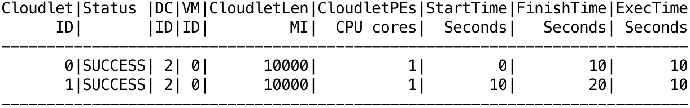

<a id="top"></a>

[](https://travis-ci.org/manoelcampos/cloudsim-plus) [](https://www.codacy.com/app/manoelcampos/cloudsim-plus?utm_source=github.com&amp;utm_medium=referral&amp;utm_content=manoelcampos/cloudsim-plus&amp;utm_campaign=Badge_Grade) [](https://www.codacy.com/app/manoelcampos/cloudsim-plus?utm_source=github.com&amp;utm_medium=referral&amp;utm_content=manoelcampos/cloudsim-plus&amp;utm_campaign=Badge_Coverage) [](http://www.gnu.org/licenses/gpl-3.0)

<p align="center">
<b><a href="#overview">Overview</a></b>
|
<b><a href="#projects-modules">Modules</a></b>
|
<b><a href="#how-to-use-cloudsim-plus">How to use</a></b>
|
<b><a href="#a-minimal-simulation-example">Example</a></b>
|
<b><a href="#documentation-and-help">Docs and Help</a></b>
|
<b><a href="#why-care">Why should I care?</a></b>
|
<b><a href="#why-another-fork">Why another fork?</a></b>
|
<b><a href="#contributions">Main Contributions</a></b>
|
<b><a href="#differences">Differences from CloudSim</a></b>
|
<b><a href="#general-features">General Features</a></b>
|
<b><a href="#publications">Publications</a></b>
|
<b><a href="#license">License</a></b>
|
<b><a href="#contributing">Contribution Guide</a></b>
</p>

# Overview

CloudSim Plus is an extensible simulation framework that enables modeling, simulation, and experimentation of emerging Cloud computing 
infrastructures and application services, allowing its users to focus on specific system design issues that they want to investigate, 
without getting concerned about the low level details related to Cloud-based infrastructures and services.
 
Cloud computing is the leading technology for delivery of reliable, secure, fault-tolerant, sustainable, and scalable computational services.
For assurance of such characteristics in cloud systems under development, it is required timely, repeatable, 
and controllable methodologies for evaluation of new cloud applications and policies, before actual development of cloud products. 
Because utilization of real testbeds limits the experiments to the scale of the testbed and makes 
the reproduction of results an extremely difficult undertaking, simulation may be used.
Accordingly, the current project is a suitable tool to rapidly develop such simulation scenarios and run them quickly, in an usual and modest PC. 

CloudSim Plus is a fork of [CloudSim 3](https://github.com/Cloudslab/cloudsim/tree/20a7a55e537181489fcb9a2d42a3e539db6c0318) 
that was re-engineered primarily to avoid code duplication for improved [code reusability](https://en.wikipedia.org/wiki/Code_reuse)
and to ensure compliance with software engineering principles and recommendations, aiming to provide a more extensible, 
less [coupled](https://en.wikipedia.org/wiki/Coupling_(computer_programming)), 
more [cohesive](https://en.wikipedia.org/wiki/Cohesion_(computer_science)) cloud simulation framework.  

It focuses on usage of software engineering standards and recommendations 
such as [Design Patterns](https://en.wikipedia.org/wiki/Software_design_pattern), 
[SOLID principles](https://en.wikipedia.org/wiki/SOLID_(object-oriented_design)) 
and other ones such as [KISS](https://en.wikipedia.org/wiki/KISS_principle) 
and [DRY](https://pt.wikipedia.org/wiki/Don't_repeat_yourself).

CloudSim Plus is developed through a partnership among the Systems, Security and Image Communication Lab of [Instituto de Telecomunicações (IT, Portugal)](http://www.it.pt), 
the [Universidade da Beira Interior (UBI, Portugal)](http://www.ubi.pt) and the 
[Instituto Federal de Educação Ciência e Tecnologia do Tocantins (IFTO, Brazil)](http://www.ifto.edu.br). 
It is supported by the Portuguese [Fundação para a Ciência e a Tecnologia (FCT)](https://www.fct.pt) 
and by the [Brazilian foundation Coordenação de Aperfeiçoamento de Pessoal de Nível Superior (CAPES)](http://www.capes.gov.br).

The original CloudSim project is developed in [the Cloud Computing and Distributed Systems (CLOUDS) Laboratory](http://cloudbus.org/), 
at [the Computer Science and Software Engineering Department](http://www.csse.unimelb.edu.au/) of [the University of Melbourne](http://www.unimelb.edu.au/).

<p align="right"><a href="#top">:arrow_up:</a></p>


# Project's Modules

CloudSim Plus has a simpler structure that can be understood right away. It consists of 5 modules, 2 of which are new, as presented below.

- [cloudsim-plus](cloudsim-plus): the CloudSim Plus cloud simulation framework API that is used by all other modules. 
  It is the main module that contains the simulation framework implementation and is the only
  one you need to write your cloud simulations. 
- [cloudsim-plus-examples](cloudsim-plus-examples): includes a series of different examples, since minimal simulation scenarios using basic 
  CloudSim Plus features, to complex scenarios using workloads from trace files or Vm migration examples. This is an excelent start point 
  for learning how to build cloud simulations using CloudSim Plus.
- [cloudsim-plus-testbeds](cloudsim-plus-testbeds): a new module that implements some simulation testbeds in a repeatable manner, 
  allowing a researcher to execute several simulation runs for a given experiment and collect statistical data using a scientific approach. 
  It represents real testbeds implemented to assess CloudSim Plus features, providing relevant results. The module provides a set of class which 
  can be used by other researchers to implement their own comprehensive testbeds. Different from the examples module that aims just
  to show how to use CloudSim Plus features, this module includes more complex simulation scenarios concerned in providing
  scientifically valid results. 
- [cloudsim-plus-benchmarks](cloudsim-plus-benchmarks): a new module introduced to implement micro benchmarks using the 
  [Java Microbenchmark Harness framework (JMH)](http://openjdk.java.net/projects/code-tools/jmh/) to enable measuring critical methods of the 
  CloudSim Plus API that have a high impact in the simulation framework performance.
- [distribution](distribution): a module used just to build jar files for distribution of packaged CloudSim Plus binaries, documentation and source code.   

<p align="right"><a href="#top">:arrow_up:</a></p>

# How to use CloudSim Plus 
CloudSim Plus is a Maven project with some modules. The easier way to use the project is relying on some IDE such as NetBeans, Eclipse or IntelliJ IDEA. 
Accordingly, you can just check the gif below or see the complete instructions in the next sub-sections.


There is a high quality video version of this gif available in [YouTube](https://youtu.be/hvFJtvrkCNI).

But if you are such a "terminal person", the sub-section below shows the instructions.

## By means of command line (if you don't like or don't want to use an IDE)
Considering that you have [git](https://git-scm.com) and [maven](http://maven.apache.org) installed on your operating system, 
download the project source by cloning the repositosy using the command `git clone https://github.com/manoelcampos/cloudsim-plus.git` 
at a terminal. 

The project has a [bash script](script/bootstrap.sh) that you can use to build and run CloudSim Plus examples. 
This is a script for Unix-like system such as Linux, FreeBDS and Mac OSX.

To run some example type the command: `sh script/bootstrap.sh package.ExampleClassName`.
For instance, to run the CloudSimExample0 you can type: `sh script/bootstrap.sh org.cloudbus.cloudsim.examples.CloudSimExample0`. 

The script checks if it is required to build the project, using maven in this case, making sure to download all dependencies. 
To see what examples are available, just navigate through the [examples directory](/cloudsim-plus-examples/src/main/java/).
To see more script options, run it without any parameter.  
 
## By means of an IDE (the easier way to just take a look or to create your own simulations)
The easier way to use the project is relying on some IDE such as [NetBeans](http://netbeans.org), [Eclipse](http://eclipse.org) 
or [IntelliJ IDEA](http://jetbrains.com/idea/).
Below are the steps to start using the project:

- Download the project sources using the download button on top of this page or clone it using `git clone https://github.com/manoelcampos/cloudsim-plus.git` 
at a terminal.
- Open/import the project in your IDE:
    - For NetBeans, just use the "Open project" menu and select the directory where the project was downloaded/cloned.
    - For Eclipse or IntelliJ IDEA, 
      you have to import the project selecting the folder where the project was cloned. 
- Inside the opened/imported project you will have the cloudsim-plus and cloudsim-plus-examples modules. 
  The cloudsim-plus module is where the simulator source code is, that usually you don't have to change, unless you want to contribute to the project. 
  The cloudsim-plus-examples is where you can start.
- Open the cloudsim-plus-examples module. The most basic examples are in the root of the org.cloudbus.cloudsim.examples package. 
  You can run any one of the classes in this package to get a specific example. 
- If you want to build your own simulations, the easiest way is to create another class inside this module.

<p align="right"><a href="#top">:arrow_up:</a></p>

# A minimal simulation example

The construction of a scenario to simulate the infrastructure of a Cloud provider is not so minimal. 
In order to build such a simulation you have to create, at least: 
- a datacenter with a list of physical machines (Hosts); 
- a broker that allows submission of VMs and Cloudlets to be executed, on behalf of a given customer, into the cloud infrastructure; 
- a list of customer's virtual machines (VMs); 
- and a list of customer's cloudlets (objects that model resource requirements of different applications).

By this way, the main code used to build such a simulation scenario can be as below. 
This is simply the code of the constructor method. 
The complete example is available at the cloudsim-plus-examples module 
[here](/cloudsim-plus-examples/src/main/java/org/cloudbus/cloudsim/examples/CloudSimExample0.java).

```java
this.vmList = new ArrayList<>();
this.cloudletList = new ArrayList<>();
//Number of cloud customers
int numberOfCloudUsers = 1; 

//Creates a CloudSim object to initialize the simulation.
CloudSim simulation = new CloudSim(numberOfCloudUsers);

Datacenter datacenter0 = createDatacenter(simulation);

/*Creates a Broker accountable for submission of VMs and Cloudlets
on behalf of a given cloud user (customer).*/
DatacenterBroker broker0 = new DatacenterBrokerSimple(simulation);

Vm vm0 = createVm(broker0);
this.vmList.add(vm0);
broker0.submitVmList(vmList);

/*Creates Cloudlets that represent applications to be run inside a VM.*/
Cloudlet cloudlet0 = createCloudlet(broker0, vm0);
this.cloudletList.add(cloudlet0);
Cloudlet cloudlet1 = createCloudlet(broker0, vm0);
this.cloudletList.add(cloudlet1);
broker0.submitCloudletList(cloudletList);

/*Starts the simulation and waits all cloudlets to be executed*/
simulation.start();

//Finishes the simulation
simulation.stop();

/*Prints results when the simulation is over
(you can use your own code here to print what you want from this cloudlet list)*/
List<Cloudlet> finishedCloudlets = broker0.getCloudletsFinishedList();
new CloudletsTableBuilderHelper(finishedCloudlets).build();
Log.printFormattedLine("Minimal Example finished!");
```

And the results are more structured and clear, including the unit of some presented data, in order to allow better understanding. 
The image below, for a simulation with two cloudlets (applications) gives you a preview. 


<p align="right"><a href="#top">:arrow_up:</a></p>

# Documentation and Help
The project documentation originated from CloudSim was entirely updated and extended. 
You can see the javadoc documentation for classes and their elements directly on your IDE.

The documentation is available online at <http://cloudsimplus.org/docs/>.
There is also a [Wiki page](https://github.com/manoelcampos/cloudsim-plus/wiki) with additional information such as a FAQ list.  

A Google Group forum is also available at <https://groups.google.com/group/cloudsim-plus>

<p align="right"><a href="#top">:arrow_up:</a></p>

<a id="why-care"></a>
# Why should I care about this CloudSim fork? I just want to build my simulations. :neutral_face:
Well, the design of the tool has a direct impact when you need to extend it in order to include some feature required for your simulations. 
The simulator provides a set of classes such as `VmSchedulers`s, `CloudletScheduler`s, `VmAllocationPolicy`s, `ResourceProvisioner`s, 
`UtilizationModel`s, `PowerModel`s and `DatacenterBroker`s that implement basic algorithms for different goals. 
For instance, the `VmAllocationPolicySimple` class implements a Worst Fit
policy that selects the PM wich less processor cores in use to host a VM and, in fact, it is the only policy available. 

Usually you have to write your own implementations of these classes, such as a Best Fit `VmAllocationPolicy`, 
a resource `UtilizationModel` with an upper threshold or a `DatacenterBroker` that selects the best `Datacenter` to submit a VM.

Considering that, several software engineering principles aim to ease the task of creating new classes to implement those features. 
They also try to avoid forcing you to change core classes of the simulator in order to introduce a feature you need to implement.
Changing these core classes is a bad practice, once you will not be able to automatically update your project to new versions 
of the simulator, without losing your changes or struggling to fix merge conflicts.  

And as we have seen in forums that we've attended, many times users have to perform these changes in core classes 
just to implement some specific features they need. 
By this way, we think those problems are enough reasons that show the need of a new re-engineered version of the simulator.  

<p align="right"><a href="#top">:arrow_up:</a></p>

<a id="why-another-fork"></a>
# But why another CloudSim fork? :unamused:
We know what you are thinking: it would be better to pull a request to the original CloudSim repository 
in order to really contribute to the project, benefiting everybody.

Well, we strongly agree with you and in fact we tried that. However, the original CloudSim moved on to a new major release, 
introducing a completely new set of classes to provide Container as a Service (CaaS) simulations, 
before the changes proposed here being merged to the official repository. 
The huge amount of contributions of CloudSim Plus are discussed in the section below. 
By this way, all the work performed here was not incorporated to allow this new CaaS module to be developed using this redesigned version.
And unfortunately, there are several months of hard work that would need to be replicated in order to merge both projects.

<p align="right"><a href="#top">:arrow_up:</a></p>

<a id="contributions"></a>
# OK, but I'm just wondering what are the real contributions of CloudSim Plus :blush:
Thanks for asking. Firstly, there is a huge amount of changes that make CloudSim Plus **NOT BACKWARD COMPATIBLE** with original CloudSim. 
However, to port your CloudSim simulations to CloudSim Plus can be relatively easy, as it will be presented further. 

Accordingly, the main contributions of CloudSim Plus are:

- Improved class hierarchy and code that is easier to understand.
- Reusable and standards-conforming code.
- Improved and extended documentation.
- Completely new Test Suites.
- New set of features.
- New examples for old and new features.
- Updated to Java 8.

All these improvements are described in details in the next sub-sections. 

## Improved class hierarchy and code that is easier to understand

- **Classes were moved to new meangnifull packages in order to ease the process of finding a class that represents a given 
  behaviour that you want to use or extend**. Some new packages are:
  	- [org.cloudbus.cloudsim.allocationpolicies](/cloudsim-plus/src/main/java/org/cloudbus/cloudsim/allocationpolicies) for `VmAllocationPolicy` classes that define how a PM is selected to host a VM.
  	- [org.cloudbus.cloudsim.brokers](/cloudsim-plus/src/main/java/org/cloudbus/cloudsim/brokers) for `DatacenterBroker` classes that define the policies for submission of customer VMs and cloudlets.
  	- [org.cloudbus.cloudsim.resources](/cloudsim-plus/src/main/java/org/cloudbus/cloudsim/resources) for resources such as CPU cores (Processor Elements - PEs), RAM, Hard Drive Storage, SAN Storage, etc.
  	- [org.cloudbus.cloudsim.schedulers](/cloudsim-plus/src/main/java/org/cloudbus/cloudsim/schedulers) for `VmScheduler` and `CloudletScheduler` classes that define how the execution of cloudlets and VMs are scheduled in the processor.
  	- [org.cloudbus.cloudsim.utilizationmodels](/cloudsim-plus/src/main/java/org/cloudbus/cloudsim/utilizationmodels) for `UtilizationModel` classes that define how a cloudlet uses physical resources.
- **More meaningful class and method names to provide clear understanding of the responsiblity of each one**: 
  usually you have to look at classes and their methods to figure out if there is a feature you want to use. 
  Not rarely you have to go through the documentation to understand what is the responsibility of a given class or method. 
  Using more specific and clear names, frequently makes you to instantaneously find out what is the method or class you need. 
  It thus relieves you to read the documentation to start coding (*despite it is really important to read the documentation,
sometimes you don't have time to go through the details*).

## Reusable and standards-conforming code

- **Cleaner code that is easier to understand, maintain and test**: a cleaner and well organized code that always follows 
  the same standards and formatting is easier to understand. 
  And talking about an open source project, the best way to understand how the software works and how you can extend it is reading the source code. 
  If it follows [clean code](http://cleancoder.com) practices, [Design Patterns](https://en.wikipedia.org/wiki/Software_design_pattern) and 
  [SOLID principles](https://en.wikipedia.org/wiki/SOLID_(object-oriented_design)), it will be easier to understand and extend.
- **Division of very long and confuse methods into small, clean and meaningful ones that usually make just one thing each one**: 
  when using the approach of reading the code to understand how it works, it is very difficult to figure out what is happening into 
  a method with dozen or hundred lines. And we'm not even discussing the problems to maintain such methods. 
  Thus, little methods with just one responsibility and with meangniful names are easier to maintain. 
  Further, they improve reuse and extension, the most important parts for you that are creating cloud simulations.
- **Improved class hierarchy following the [Interface Segregation Principle (ISP)](https://en.wikipedia.org/wiki/Interface_segregation_principle) 
  and [Open/Closed Principle (OCP)](https://en.wikipedia.org/wiki/Open/closed_principle) to increase reausability and facility for extension**: 
  the ISP states that ["no client should be forced to depend on methods it does not use"](https://en.wikipedia.org/wiki/Interface_segregation_principle#cite_note-ASD-1) 
  and the OCP states that ["software entities (classes, modules, functions, etc.) should be open for extension, but closed for modification"](https://en.wikipedia.org/wiki/Open/closed_principle#cite_note-1). 
  These principles together impact directly developers that need to extend some simulator class to implement a desired behaviour 
  (such as a specific `CloudletScheduler`). The ISP preach that you should have a great number of small classes following the 
  [Single Responsibility Principle (SRP)](https://en.wikipedia.org/wiki/Single_responsibility_principle) instead of a small set of big classes. 
  By this way, if you need to extend a given behaviour, usually you just have to extend a specific and little class, 
  that has less code for you to worry about. By the other hand, the OCP relieves you of changing simulator classes to include a desired behaviour. 
  Thus, it focuses on trying to give you the serenity to change just your code. 
- **Both use of OCP and ISP to try to avoid changing base classes to include some new behaviour
  and the bad [copy-and-paste anti-pattern](https://sourcemaking.com/antipatterns/cut-and-paste-programming)**: 
  copy-and-paste is a bad practice that degrades the source code along the time. 
  It makes difficulty to correct bugs when there may be several copies of the problematic code. 
  The duplicated code has to be tested several times, what usually leads to neglecting tests. 
  Further, along the time, the number of duplicated code just increases. 

## Improved documentation

- **Entirely documentation review and update**, improving explanation of classes and method responsibilities, 
  fixing issues, correcting broken links, updating documentation that didn't reflect methods and classes' responsibility anymore.
- **Documentation extension** to make clear the key points of classes and methods.
- **Removal of duplicated documentation** that just gets out-of-date along the time. 
  Subclasses that had documentation copied from the super class, just inherit the documentation or extend it using the 
  javadoc [@inheritdoc](http://docs.oracle.com/javase/6/docs/technotes/tools/solaris/javadoc.html#inheritingcomments) tag.
- **Inclusion of some missing documentation** and update of that ones just repeating the name of a method or attribute. 
  For instance, a javadoc such as "This is the id", doesn't help in anyway.

## Completely new Test Suites

The original CloudSim already has some unit test suites, however, there aren't coverage reports enabled in the project. 
After enabling these reports, it was realized that just 20% of the code was being covered by unit tests. 
Tests are really important to try ensuring that the software works as expected and gives more security 
and peace of mind to refactor the code, perform changes and fix bugs :pray:. 
After all, a broad code coverage also tries to ensure that you are getting accurate results from your simulations.

Finally, an entire simulation is very complex, integrating several classes communicating among themselves. Once, unit tests just check
isolated method calls, integration/functional tests are required to validate entire simulation scenarios.
This project introduces a set of such tests in order to increase simulation accuracy.
Thus, the contributions in this area are as follows:

- Functional/integration tests using JUnit to test a set of classes working together and overall simulation scenarios.
- Continuous integration using [Travis](http://travis-ci.org) service (see the badge at the top of this file).
- Inclusion of Maven Coverage Plugin to start tracking the percentage of code that is being coverage by unit tests.
- Inclusion of public code coverage reports using [Codacy](http://codacy.com) service (see the badge at the top of this file). 
  The code coverage raised from 20% to [](https://www.codacy.com/app/manoelcampos/cloudsim-plus?utm_source=github.com&amp;utm_medium=referral&amp;utm_content=manoelcampos/cloudsim-plus&amp;utm_campaign=Badge_Coverage).
- Bug fixes.

## New set of features

Some totally new features were introduced in CloudSim Plus:

- **A `TableBuilder` interface and a set of implementing classes to automate the process of printing simulation 
  results in different formats such as Text (ASCII), CSV and HTML**: the interface and classes are available
  at the [org.cloudsimplus.util.tablebuilder](/cloudsim-plus/src/main/java/org/cloudsimplus/util/tablebuilder/) package. 
  To print results of a list of executed cloudlet you can use a single line of code such as 
  `new CloudletsTableBuilderHelper(broker.getCloudletsFinishedList()).build();`. 
  All the perfectly aligned tables that you will see after running the examples use the `TextTableBuilder` class.
- **Listener objects that allow you to be notified when different events happen during your simulation execution**: 
  interfaces and classes included in the [org.cloudsimplus.listeners](/cloudsim-plus/src/main/java/org/cloudsimplus/listeners/) 
  package allow you to keep track of simulation execution and perform additional tasks when a given event happens. 
  These listeners were implemented for some CloudSim Plus classes such as below (the next section describes examples of this feature):
    - at `CloudSim` class: to notify observers when any event is processed by CloudSim Plus.      
    - at `Host` class: to notify observers when VMs processing is updated.
    - at `Vm` class: to notify observers when a host is allocated to a VM, a host is deallocated for a VM or the creation of a VM fails. 
    - at `Cloudlet` class: to notify observers when a cloudlet finishes executing.
- **A set of builder classes to automate the process of creating multiple simulation objects such as 
  `Datacenter`s, `Host`s, `Vm`s and `Cloudlet`s**: [Builder](https://en.wikipedia.org/wiki/Builder_pattern) is a design pattern 
  used to ease the creation of objects. As several simulations require the developer to create multiple instances of a 
  given object with the same attribute values (such as several identical hosts), that starts being a repetitive, 
  time-consuming and boring task. 
  The package [org.cloudsimplus.builders](/cloudsim-plus/src/main/java/org/cloudsimplus/builders/) 
  provides a set of classes to automate the instantiation of such objects. 
  The class [SimulationScenarioBuilder](/cloudsim-plus/src/main/java/org/cloudsimplus/builders/SimulationScenarioBuilder.java) 
  is the start point to access all the introduced builders. 
  New examples were not included yet, but the [Integration Tests package](/cloudsim-plus/src/test/java/org/cloudsimplus/IntegrationTests/) 
  makes intensive use of such a new feature.
- **Delay the submission of cloudlets to VM**, simulating the dynamic arrival of cloudlets 
  inside the Cloud provider infrastructure. See the issue #11 for more details.  

## New examples for old and new features

New concise and easy to understand examples of features that have lots of questions at forums were included, such as:
- [Dynamic creation of cloudlets based on workload traces](/cloudsim-plus-examples/src/main/java/org/cloudsimplus/examples/workload/): 
  the example dynamically creates cloudlets according to the data of a workload trace file. 
  VMs are created to fulfil cloudlets' requirements and, in its turn, Hosts are created to fulfil VMs' requirements. 
  It may not represent a real world use case, but the example can be adapted according to developer needs.  
- [VM migration](/cloudsim-plus-examples/src/main/java/org/cloudsimplus/examples/migration/): 
  the example performs VM migrations based on Host utilization threshold. 
- Implementation of custom `DatacenterBroker` and `VmAllocationPolicy` for the given examples.
- Examples using the new Listener features were included to the package 
  [org.cloudsimplus.examples.listeners](/cloudsim-plus-examples/src/main/java/org/cloudsimplus/examples/listeners/).

## Updated to Java 8

The [CloudSim Plus module](/cloudsim-plus), that represents the Cloud Simulation API, now requires the JDK 8 and makes intensive use of 
[Lambda Expressions, Streams and Functional Programming](http://www.oracle.com/webfolder/technetwork/tutorials/obe/java/Lambda-QuickStart/index.html) 
of the Java 8. However, [cloudsim-plus-examples](/cloudsim-plus-examples) project was updated just from Java 6 to 7 aiming 
to provide yet simple examples for beginner Java programmers, but less verbose code than Java 6.

The amazing Java 8 features allow developers to drastically reduce the number of lines to implement basic tasks such as iteration, filtering,
sorting and processing of lists, as well as reduction of [boilerplate code](https://en.wikipedia.org/wiki/Boilerplate_code) required 
to use classes having just one method.

For instance, see the code below to create a Thread in Java 7:

```java
Runnable task1 = 
    new Runnable(){
        @Override
        public void run() {
            //Your code to be run by the thread
        }
    };     
        
new Thread(task1).start();
```

In Java 8 you can just write:

```java
new Thread(() -> {
    //Your code to be run by the thread
}).start();
```

The iteration over lists now can be performed easily using the stream API. 
The example below uses a single line of code to iterate over a list of cloudlets, binding every one to a given VM.

```java
cloudletList.forEach(cloudlet -> broker.bindCloudletToVm(cloudlet.getId(), vm.getId()));
```

This makes the code clearer to understand and less verbose. Further, the new Stream API provides a complete set of features 
that even increases performance, such as allowing the 
[parallel processing of lists](http://www.oracle.com/webfolder/technetwork/tutorials/obe/java/Lambda-QuickStart/index.html#section5).

For more information about the changes and features included in this release, please read the [CHANGELOG](CHANGELOG.md) 
file and the [cloudsim-plus-examples](/cloudsim-plus-examples) project.

<p align="right"><a href="#top">:arrow_up:</a></p>

<a id="differences"></a>
# What are the practical differences of using CloudSim Plus instead of CloudSim? How can I update my simulations in order to use CloudSim Plus?

To update your simulations to use the new CloudSim Plus you have to change the way that some objects are instantiated, because 
there were introduced some new interfaces to follow the "program to an interface, not an implementation" 
recommendation and also to increase [abstraction](https://en.wikipedia.org/wiki/Abstraction_(software_engineering)). 
These new interfaces were also crucial to implement the [Null Object Pattern](https://en.wikipedia.org/wiki/Null_Object_pattern) 
in order to try avoiding `NullPointerException`s.

By this way, the classes `Datacenter`, `DatacenterCharacteristics`, `Host`, `Pe`, `Vm` and `Cloudlet` were renamed due to 
the introduction of interfaces with these same names. Now all these classes have a suffix *Simple* 
(as already defined for some previous classes such as `PeProvisionerSimple` and `VmAllocationPolicySimple`). 
For instance, to instantiate a `Cloudlet` you have to execute a code such as:

 ```java
CloudletSimple cloudlet = new CloudletSimple(required, parameters, here);
```   

However, once these interfaces were introduced in order to also enable the creation of different cloudlet classes, 
the recommendation is to declare your object using the interface, not the class: 
 
 ```java
Cloudlet cloudlet = new CloudletSimple(required, parameters, here);
```   

Once the packages were reorganized, you have to adjust them. However, use your IDE to correct the imports for you.

Additionally, the interface `Storage` was renamed to `FileStorage` and its implementations are `SanStorage` and `HarddriveStorage`, that can be used as before.
Finally, the way you instantiate a host has changed too. 
There aren't the classes `RamProvisionerSimple` and `BwProvisionerSimple` anymore. 
Now you just have the generic class `ResourceProvisionerSimple`. 
And this class doesn't require a primitive value to define the resource capacity.
Instead, it requires an object that implements the new `Resource` interface (such as the `Ram` and `Bandwidth` classes). 
By this way, to instantiate a host you can use a code such as below:

```java
long ram = 20480; //in MB
long bw = 1000000; //in Megabits/s
long storage = 1000000; //in MB
Host host = new HostSimple(id, storage, pesList)
        .setRamProvisioner(new ResourceProvisionerSimple(new Ram(ram)))
        .setBwProvisioner(new ResourceProvisionerSimple(new Bandwidth(bw)))
        .setVmScheduler(new VmSchedulerTimeShared(pesList));
``` 

<p align="right"><a href="#top">:arrow_up:</a></p>

<a id="general-features"></a>
# General features of the simulator

  * Support for modeling and simulation of large scale Cloud computing data centers.
  * Support for modeling and simulation of virtualized server hosts, with customizable policies for provisioning host resources to virtual machines.
  * Support for modeling and simulation of energy-aware computational resources.
  * Support for modeling and simulation of data center network topologies and message-passing applications.
  * Support for modeling and simulation of federated clouds.
  * Support for dynamic insertion of simulation elements, stop and resume of simulation.
  * Support for user-defined policies for allocation of hosts to virtual machines and policies for allocation of host resources to virtual machines.

<p align="right"><a href="#top">:arrow_up:</a></p>

<a id="publications"></a>
# Publications of the original CloudSim version

  * Anton Beloglazov, and Rajkumar Buyya, [Optimal Online Deterministic Algorithms and Adaptive Heuristics for Energy and Performance Efficient Dynamic Consolidation of Virtual Machines in Cloud Data Centers](http://beloglazov.info/papers/2012-optimal-algorithms-ccpe.pdf), Concurrency and Computation: Practice and Experience, Volume 24, Number 13, Pages: 1397-1420, John Wiley & Sons, Ltd, New York, USA, 2012.
  * Saurabh Kumar Garg and Rajkumar Buyya, [NetworkCloudSim: Modelling Parallel Applications in Cloud Simulations](http://www.cloudbus.org/papers/NetworkCloudSim2011.pdf), Proceedings of the 4th IEEE/ACM International Conference on Utility and Cloud Computing (UCC 2011, IEEE CS Press, USA), Melbourne, Australia, December 5-7, 2011.
  * **Rodrigo N. Calheiros, Rajiv Ranjan, Anton Beloglazov, Cesar A. F. De Rose, and Rajkumar Buyya, [CloudSim: A Toolkit for Modeling and Simulation of Cloud Computing Environments and Evaluation of Resource Provisioning Algorithms](http://www.buyya.com/papers/CloudSim2010.pdf), Software: Practice and Experience (SPE), Volume 41, Number 1, Pages: 23-50, ISSN: 0038-0644, Wiley Press, New York, USA, January, 2011. (Preferred reference for CloudSim)**
  * Bhathiya Wickremasinghe, Rodrigo N. Calheiros, Rajkumar Buyya, [CloudAnalyst: A CloudSim-based Visual Modeller for Analysing Cloud Computing Environments and Applications](http://www.cloudbus.org/papers/CloudAnalyst-AINA2010.pdf), Proceedings of the 24th International Conference on Advanced Information Networking and Applications (AINA 2010), Perth, Australia, April 20-23, 2010.
  * Rajkumar Buyya, Rajiv Ranjan and Rodrigo N. Calheiros, [Modeling and Simulation of Scalable Cloud Computing Environments and the CloudSim Toolkit: Challenges and Opportunities](http://www.cloudbus.org/papers/CloudSim-HPCS2009.pdf), Proceedings of the 7th High Performance Computing and Simulation Conference (HPCS 2009, ISBN: 978-1-4244-4907-1, IEEE Press, New York, USA), Leipzig, Germany, June 21-24, 2009.
  
<p align="right"><a href="#top">:arrow_up:</a></p>
  
# License

This project is licensed under [GNU GPLv3](http://www.gnu.org/licenses/gpl-3.0), as defined in CloudSim 3 source codes.

<p align="right"><a href="#top">:arrow_up:</a></p>

# Contributing

If you desire to contribute to the project, you are welcome. However, make sure to read the [contribution guide](CONTRIBUTING.md) before you start.
If you just want to request a feature, feel free to use the [issues page](https://github.com/manoelcampos/cloudsim-plus/issues).

<p align="right"><a href="#top">:arrow_up:</a></p>
