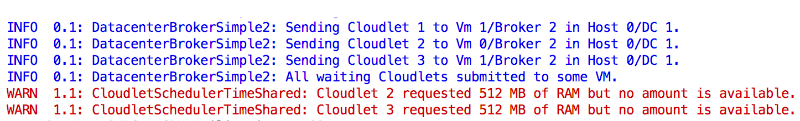

<a id="top"></a>

<p align="center">
<b><a href="#overview">Overview</a></b>
|
<b><a href="#exclusive-features">Exclusive Features</a></b>
|
<b><a href="#structure">Structure</a></b>
|
<b><a href="#usage">How to use</a></b>
|
<b><a href="#example">Example</a></b>
|
<b><a href="#docs-help">Docs and Help</a></b>
|
<b><a href="#consulting">Consulting</a></b>
|
<b><a href="#general-features">General Features</a></b>
|
<b><a href="#publications">Publications</a></b>
|
<b><a href="#projects">Related Projects</a></b>
|
<b><a href="#license">License</a></b>
|
<b><a href="#contributing">Contributing</a></b>
</p>

<a id="overview"></a>

# 1. Overview

[](#consulting) [](https://github.com/cloudsimplus/cloudsimplus/actions/workflows/build.yml) [](https://www.codacy.com/gh/cloudsimplus/cloudsimplus/dashboard?utm_source=github.com&amp;utm_medium=referral&amp;utm_content=cloudsimplus/cloudsimplus&amp;utm_campaign=Badge_Grade) [](https://www.codacy.com/gh/manoelcampos/cloudsimplus/dashboard?utm_source=github.com&utm_medium=referral&utm_content=manoelcampos/cloudsimplus&utm_campaign=Badge_Coverage) [](https://search.maven.org/search?q=g:%22org.cloudsimplus%22%20AND%20a:%22cloudsimplus%22) [](http://cloudsimplus.rtfd.io/en/latest/?badge=latest) [](http://www.gnu.org/licenses/gpl-3.0) [](https://github.com/cloudsimplus/cloudsimplus) [](http://twitter.com/cloudsimplus)

CloudSim Plus is a modern, up-to-date, full-featured and fully documented **Java 17** simulation framework. It's easy to use and extend, enabling modeling, simulation, and experimentation of Cloud computing infrastructures and application services. 
It allows developers to focus on specific system design issues to be investigated, without concerning the low-level details related to Cloud-based infrastructures and services.
 
CloudSim Plus is a fork of CloudSim 3, re-engineered primarily to avoid code duplication, provide [code reuse](https://en.wikipedia.org/wiki/Code_reuse) and ensure compliance with software engineering principles and recommendations for extensibility improvements and accuracy. It's currently the state-of-the-art in cloud computing simulation framework. 

The efforts dedicated to this project have been recognized by the [EU/Brasil Cloud FORUM](https://eubrasilcloudforum.eu). 
A post about CloudSim Plus is available at 
[this page of the Forum](https://eubrasilcloudforum.eu/en/instituto-federal-de-educação-do-tocantins-brazil-instituto-de-telecomunicações-portugal-and), including a White Paper available in the [Publications Section](#publications).

CloudSim Plus started through a partnership between the [Instituto de Telecomunicações (IT, Portugal)](http://www.it.pt), 
the [Universidade da Beira Interior (UBI, Portugal)](http://www.ubi.pt) 
and the [Instituto Federal de Educação Ciência e Tecnologia do Tocantins (IFTO, Brazil)](http://www.ifto.edu.br). 
It was partially supported by the Portuguese [Fundação para a Ciência e a Tecnologia (FCT)](https://www.fct.pt) 
and by the [Brazilian foundation Coordenação de Aperfeiçoamento de Pessoal de Nível Superior (CAPES)](http://www.capes.gov.br).

> **Note**
> If you are using CloudSim Plus in your research, please make sure you cite this paper: M. C. Silva Filho, R. L. Oliveira, C. C. Monteiro, P. R. M. Inácio, and M. M. Freire. [CloudSim Plus: a Cloud Computing Simulation Framework Pursuing Software Engineering Principles for Improved Modularity, Extensibility and Correctness,](https://doi.org/10.23919/INM.2017.7987304) in IFIP/IEEE International Symposium on Integrated Network Management, 2017, p. 7.

**IMPORTANT**
---
- Developing and maintaining this project takes a huge effort. This way, any kind of [contribution](#contributing) is encouraged. Show your support by giving it a star :star: using the button at the top of the GitHub page. It takes no time, helps promoting the project and keeps it evolving. Thanks in advance :clap:.
- If you are not intending to make changes and contribute back to the project, you shouldn't fork it. Your fork become obsolete as the project is updated. 
- If you're willing to use the framework to develop your own project on top of it, creating a fork is the worst way. You aren't supposed to change the framework code to implement your project, but to extend it by creating some subclasses. Unless you are planning to contribute your changes back, you'll end up with an incompatible and obsolete version of the framework. The project is constantly evolving and bugfixes are a priority. Your fork with personal changes will miss those updates and high performance improvements.
---

<p align="right"><a href="#top">:arrow_up:</a></p>

<a id="exclusive-features"></a>

# 2. Main Exclusive Features 🧰

CloudSim Plus provides lots of exclusive features, from the most basic ones to build simple simulations, 
to advanced features for simulating more realistic cloud scenarios: 

1. It is easier to use. [A complete and easy-to-understand simulation scenario can be built in few lines of code.](#example)
2. Multi-cloud simulations with inter-datacenter VM migrations ([#361](https://github.com/cloudsimplus/cloudsimplus/issues/361)).
3. Creation of joint power- and network-aware simulations ([#45](https://github.com/cloudsimplus/cloudsimplus/issues/45)).
4. Vertical ([#7](https://github.com/cloudsimplus/cloudsimplus/issues/7)) and Horizontal VM scaling ([#41](https://github.com/cloudsimplus/cloudsimplus/issues/41)).
5. [Highly accurate power usage computation](https://github.com/cloudsimplus/cloudsimplus-examples/blob/master/src/main/java/org/cloudsimplus/examples/power/PowerExampleSchedulingInterval.java) ([#153](https://github.com/cloudsimplus/cloudsimplus/issues/153)).
6. [Built-in computation of CPU utilization history and energy consumption for VMs (and Hosts)](https://github.com/cloudsimplus/cloudsimplus-examples/blob/master/src/main/java/org/cloudsimplus/examples/power/PowerExample.java) ([#168](https://github.com/cloudsimplus/cloudsimplus/issues/168)).
7. [Virtual Memory and Reduced bandwidth allocation](https://github.com/cloudsimplus/cloudsimplus-examples/blob/master/src/main/java/org/cloudsimplus/examples/resourceusage/VirtualMemoryForRequestedRamHigherThanAvailableExample.java) when RAM and BW are oversubscribed. ([#170](https://github.com/cloudsimplus/cloudsimplus/issues/170)). 
8. [Automatically power Hosts on and off according to demand](https://github.com/cloudsimplus/cloudsimplus-examples/blob/master/src/main/java/org/cloudsimplus/examples/power/HostActivationExample.java) ([#128](https://github.com/cloudsimplus/cloudsimplus/issues/128)) and support defining a startup and shutdown delay/power consumption ([#238](https://github.com/cloudsimplus/cloudsimplus/issues/238)).
9. [Parallel execution of simulations in multi-core computers](https://github.com/cloudsimplus/cloudsimplus-examples/blob/master/src/main/java/org/cloudsimplus/examples/ParallelSimulationsExample.java), allowing multiple simulations to be run simultaneously in an isolated way ([#38](https://github.com/cloudsimplus/cloudsimplus/issues/38)).
10. Delay creation of submitted VMs and [Cloudlets](https://github.com/cloudsimplus/cloudsimplus-examples/blob/master/src/main/java/org/cloudsimplus/examples/dynamic/DynamicCloudletsArrival1.java), enabling simulation of dynamic arrival of tasks ([#11](https://github.com/cloudsimplus/cloudsimplus/issues/11), [#23](https://github.com/cloudsimplus/cloudsimplus/issues/23)). 
11. [Allow dynamic creation of VMs and Cloudlets in runtime](https://github.com/cloudsimplus/cloudsimplus-examples/blob/master/src/main/java/org/cloudsimplus/examples/dynamic/DynamicCreationOfVmsAndCloudletsExample.java), enabling VMs to be created on-demand ([#43](https://github.com/cloudsimplus/cloudsimplus/issues/43)).
12. [Listeners](https://github.com/cloudsimplus/cloudsimplus-examples/blob/master/src/main/java/org/cloudsimplus/examples/listeners) to enable simulation configuration, monitoring and data collection.
13. Create [simulations](https://github.com/cloudsimplus/cloudsimplus-examples/tree/master/src/main/java/org/cloudsimplus/examples/traces/google) from [Google Cluster Data](https://github.com/google/cluster-data/blob/master/ClusterData2011_2.md) 
    trace files. ([#149](https://github.com/cloudsimplus/cloudsimplus/issues/149)).
14. Strongly object-oriented, allowing chained calls such as `cloudlet.getVm().getHost().getDatacenter()` without even worrying about `NullPointerException` ([#10](https://github.com/cloudsimplus/cloudsimplus/issues/10)).
15. Classes and interfaces for implementing [heuristics](http://en.wikipedia.org/wiki/Heuristic) such as [Tabu Search](http://en.wikipedia.org/wiki/Tabu_search), [Simulated Annealing](http://en.wikipedia.org/wiki/Simulated_annealing), [Ant Colony Systems](http://en.wikipedia.org/wiki/Ant_colony_optimization_algorithms) and so on ([example here](https://github.com/cloudsimplus/cloudsimplus-examples/blob/master/src/main/java/org/cloudsimplus/examples/brokers/DatacenterBrokerHeuristicExample.java)).
16. [Implementation of the Completely Fair Scheduler](https://en.wikipedia.org/wiki/Completely_Fair_Scheduler) used in recent versions of the Linux Kernel ([example here](https://github.com/cloudsimplus/cloudsimplus-examples/blob/master/src/main/java/org/cloudsimplus/examples/schedulers/LinuxCompletelyFairSchedulerExample.java)) ([#58](https://github.com/cloudsimplus/cloudsimplus/issues/58)).
17. [Host Fault Injection and Recovery Mechanism](https://github.com/cloudsimplus/cloudsimplus-examples/blob/master/src/main/java/org/cloudsimplus/examples/HostFaultInjectionExample1.java) to enable injection of random failures into Hosts CPU cores and replication of failed VMs ([#81](https://github.com/cloudsimplus/cloudsimplus/issues/81)).
18. [Creation of Hosts at Simulation Runtime](https://github.com/cloudsimplus/cloudsimplus-examples/blob/master/src/main/java/org/cloudsimplus/examples/dynamic/DynamicHostCreation.java) to enable physical expansion of Datacenter capacity ([#124](https://github.com/cloudsimplus/cloudsimplus/issues/124)).
19. [Enables the simulation to keep running, waiting for dynamic and even random events such as the arrival of Cloudlets and VMs](https://github.com/cloudsimplus/cloudsimplus-examples/blob/master/src/main/java/org/cloudsimplus/examples/dynamic/KeepSimulationRunningExample.java) ([#130](https://github.com/cloudsimplus/cloudsimplus/issues/130)).
20. TableBuilder objects that are used in all examples and enable printing simulation results in different formats such as Markdown Table, CSV or HTML.
21. Colors log messages and enables filtering the level of messages to print ([#24](https://github.com/cloudsimplus/cloudsimplus/issues/24)).  If you want to just see messages from warning level, call `Log.setLevel(ch.qos.logback.classic.Level.WARN);`
22. [Enables running the simulation synchronously, making it easier to interact with it and collect data inside a loop, as the simulation goes on](https://github.com/cloudsimplus/cloudsimplus-examples/blob/master/src/main/java/org/cloudsimplus/examples/synchronous/SynchronousSimulationExample1.java). This brings freedom to implement your simulations ([#205](https://github.com/cloudsimplus/cloudsimplus/issues/205)).
23. [Allows placing a group of VMs into the same Host.](https://github.com/cloudsimplus/cloudsimplus-examples/blob/master/src/main/java/org/cloudsimplus/examples/VmGroupPlacementExample1.java) ([#90](https://github.com/cloudsimplus/cloudsimplus/issues/90)).
24. [Enables Broker to try selecting the closest Datacenter to place VMs, according to their time zone.](https://github.com/cloudsimplus/cloudsimplus-examples/blob/master/src/main/java/org/cloudsimplus/examples/brokers/DatacenterSelectionByTimeZoneExample.java) ([#212](https://github.com/cloudsimplus/cloudsimplus/issues/212)).
25. It outperforms CloudSim 4, as can be seen [here](docs/performance.md).

<a id="structure"></a>

# 3. Project's Structure 🏗

CloudSim Plus has a simpler structure to make it ease to use and understand. It consists of 4 modules, 2 of which are new, as presented below.


- cloudsimplus (this module): the CloudSim Plus cloud simulation framework API, which is used by all other modules. 
  It is the main and only required module you need to write cloud simulations. 
- [cloudsimplus-examples](https://github.com/cloudsimplus/cloudsimplus-examples): includes a series of different examples, since minimal simulation scenarios using basic 
  CloudSim Plus features, to complex scenarios using workloads from trace files or Vm migration examples. This is an excellent starting point for learning how to build cloud simulations using CloudSim Plus.
- [cloudsimplus-testbeds](https://github.com/cloudsimplus/cloudsimplus-testbeds): enables implementation of simulation testbeds in a repeatable manner, 
  allowing a researcher to execute several simulation runs for a given experiment and collect statistical data using a scientific approach. 
- [cloudsimplus-benchmarks](https://github.com/cloudsimplus/cloudsimplus-benchmarks): a new module used just internally to implement micro benchmarks to assess framework performance.

It also has a better package organization, 
improving [Separation of Concerns (SoC)](https://en.wikipedia.org/wiki/Separation_of_concerns) 
and making it easy to know where a desired class is and what is inside each package. 
The figure below presents the new package organization. 
The dark yellow packages are new in CloudSim Plus and include its exclusive interfaces and classes. 
The light yellow ones were introduced just to better organize existing CloudSim classes and interfaces. 


<p align="right"><a href="#top">:arrow_up:</a></p>

<a id="usage"></a>

# 4. How to Use CloudSim Plus 👩🏽‍💻 

> **Warning**
> Before trying to use this project, make sure you have JDK 17 installed.

There are 2 ways to use CloudSim Plus:

- creating your own project and add it as a dependency. This way, it will be downloaded directly from [Maven Central](https://maven-badges.herokuapp.com/maven-central/org.cloudsimplus/cloudsimplus).
- downloading the [cloudsimplus-examples](https://github.com/cloudsimplus/cloudsimplus-examples) project and follow the instructions there.

Check sections below if you want to add CloudSim Plus as a dependency into your own Maven or Gradle project. This way you can start building your simulations from scratch.

## 4.1 Maven

Add the following dependency into the pom.xml file of your own Maven project. 

```xml
<dependency>
    <groupId>org.cloudsimplus</groupId>
    <artifactId>cloudsimplus</artifactId>
    <!-- Set a specific version or use the latest one -->
    <version>LATEST</version>
</dependency>
```

## 4.2 Gradle

Add the following dependency into the build.gradle file of your own Gradle project. 

```groovy
dependencies {
    //Set a specific version or use the latest one
    implementation 'org.cloudsimplus:cloudsimplus:LATEST'
}
```

<p align="right"><a href="#top">:arrow_up:</a></p>

<a id="example"></a>

# 5. A Minimal but Complete Simulation Example ⚙️

In order to build a simulation scenario, you have to create at least:
 
- a datacenter with a list of physical machines (Hosts); 
- a broker that allows submission of VMs and Cloudlets to be executed, on behalf of a given customer, into the cloud infrastructure; 
- a list of customer's virtual machines (VMs); 
- and a list of customer's cloudlets (objects that model resource requirements of different applications).

Due to the simplicity provided by CloudSim Plus, all the code to create a minimal simulation scenario can be as simple as presented below.
A more adequate and reusable example is available
[here](https://github.com/cloudsimplus/cloudsimplus-examples/blob/master/src/main/java/org/cloudsimplus/examples/BasicFirstExample.java),
together with other ones available in the [cloudsimplus-examples](https://github.com/cloudsimplus/cloudsimplus-examples) repository. 

```java
//Enables just some level of logging.
//Make sure to import org.cloudsimplus.util.Log;
//Log.setLevel(ch.qos.logback.classic.Level.WARN);

//Creates a CloudSimPlus object to initialize the simulation.
var simulation = new CloudSim();

//Creates a Broker that will act on behalf of a cloud user (customer).
var broker0 = new DatacenterBrokerSimple(simulation);

//Host configuration
long ram = 10000; //in Megabytes
long storage = 100000; //in Megabytes
long bw = 100000; //in Megabits/s
        
//Creates one host with a specific list of CPU cores (PEs).
//Uses a PeProvisionerSimple by default to provision PEs for VMs
//Uses ResourceProvisionerSimple by default for RAM and BW provisioning
//Uses VmSchedulerSpaceShared by default for VM scheduling
var host0 = new HostSimple(ram, bw, storage, List.of(new PeSimple(20000)));

//Creates a Datacenter with a list of Hosts.
//Uses a VmAllocationPolicySimple by default to allocate VMs
var dc0 = new DatacenterSimple(simulation, List.of(host0));

//Creates one VM with one CPU core to run applications.
//Uses a CloudletSchedulerTimeShared by default to schedule Cloudlets
var vm0 = new VmSimple(1000, 1);
vm0.setRam(1000).setBw(1000).setSize(1000);

//Creates Cloudlets that represent applications to be run inside a VM.
//It has a length of 1000 Million Instructions (MI) and requires 1 CPU core 
//UtilizationModel defining the Cloudlets use only 50% of any resource all the time
var utilizationModel = new UtilizationModelDynamic(0.5);
var cloudlet0 = new CloudletSimple(10000, 1, utilizationModel);
var cloudlet1 = new CloudletSimple(10000, 1, utilizationModel);
var cloudletList = List.of(cloudlet0, cloudlet1);

broker0.submitVmList(List.of(vm0));
broker0.submitCloudletList(cloudletList);

/*Starts the simulation and waits all cloudlets to be executed, automatically
stopping when there is no more events to process.*/
simulation.start();

/*Prints the results when the simulation is over
(you can use your own code here to print what you want from this cloudlet list).*/
new CloudletsTableBuilder(broker0.getCloudletFinishedList()).build();
```

The presented results are structured and clear to allow better understanding. 
For example, the image below shows the output for a simulation with two cloudlets (applications).


## 5.1 Comparison with CloudSim

A complete, side-by-side [comparison between CloudSim and CloudSim
Plus Java simulation scenarios
is available
here](http://cloudsimplus.org/docs/CloudSim-and-CloudSimPlus-Comparison.html).

<p align="right"><a href="#top">:arrow_up:</a></p>

<a id="docs-help"></a>

# 6. Documentation and Help 📘🆘

The project documentation originated from CloudSim was entirely updated and extended. 
You can see the javadoc documentation for classes and their elements directly on your IDE.

The documentation is available online at [ReadTheDocs](http://cloudsimplus.rtfd.io/en/latest/?badge=latest), 
which includes a FAQ and guides.
CloudSim Plus has extended documentation of classes and interfaces and also includes extremely helpful
package documentation that can be viewed directly on your IDE or at the link provided above.
Such a package documentation gives a general overview of the classes used to build a cloud simulation. Also, check the [publications](#publications) section to access published CloudSim Plus papers.

A Google Group forum is available at <https://groups.google.com/group/cloudsimplus> and you can also use the [Discussions page here](https://github.com/cloudsimplus/cloudsimplus/discussions).

<p align="right"><a href="#top">:arrow_up:</a></p>

<a id="consulting"></a>

# 7. Consulting 👨🏽‍🏫

If you are doing research on cloud computing simulation and facing challenging issues, I've started to offer my consulting services.

I can help you with different kinds of issues and provide specific features for your simulations, including resource allocation, task scheduling, VM placement and migration, metrics computation, process automation, debugging, results analysis, validation and more.

If you have a CloudSim project and want to migrate to CloudSim Plus to benefit from its extensive documentation, active development and support, exclusive features, great accuracy and performance, the consulting can be fit for you too.

**Get the [contact e-mail here](https://github.com/manoelcampos).**

<a id="general-features"></a>

# 8. General Features of the Framework 🛠

CloudSim Plus supports modeling and simulation of:

* large scale Cloud computing data centers;
* virtualized server hosts, with customizable policies for provisioning host resources to virtual machines;
* data center network topologies and message-passing applications;
* federated clouds;
* user-defined policies for allocation of hosts to virtual machines and policies for allocation of host resources to virtual machines.

<p align="right"><a href="#top">:arrow_up:</a></p>

<a id="publications"></a>

# 8. CloudSim Plus Publications 📝

1. M. C. Silva Filho, R. L. Oliveira, C. C. Monteiro, P. R. M. Inácio, and M. M. Freire. [CloudSim Plus: a Cloud Computing Simulation Framework Pursuing Software Engineering Principles for Improved Modularity, Extensibility and Correctness,](https://doi.org/10.23919/INM.2017.7987304) in IFIP/IEEE International Symposium on Integrated Network Management, 2017, p. 7. If you are using CloudSim Plus in your research, please make sure you cite that paper. You can check the paper presentation [here](http://cloudsimplus.org/docs/presentation/).
2. White Paper. [CloudSim Plus: A Modern Java 17+ Framework for Modeling and Simulation of Cloud Computing Infrastructures and Services](https://cloudsimplus.github.io/cloudsimplus-whitepaper). 2016.
3. R. L. Oliveira. [Virtual Machine Allocation in Cloud Computing Environments based on Service Level Agreements](https://doi.org/10400.6/7839) (only in Portuguese). Master's Dissertation. University of Beira Interior, 2017 (Supervisor: M. M. Freire).
  
<p align="right"><a href="#top">:arrow_up:</a></p>

<a id="projects"></a>

# 9. Related Projects 🧩

Here, it's presented a list of some projects based on CloudSim Plus, which trust in its accuracy, performance, maintainability and extensibility.
If you want your project to be listed here, send us a Pull Request. Make sure your project has a descriptive README.

1. [PureEdgeSim: A simulation toolkit for performance evaluation of Fog and pure Edge computing environments.](https://github.com/CharafeddineMechalikh/PureEdgeSim)
1. [CloudSim Plus Py4j gateway: building CloudSim Plus simulations in Python](https://github.com/pkoperek/cloudsimplus-gateway)
1. [RECAP Discrete Event Simulation Framework an extension for CloudSimPlus](https://bitbucket.org/RECAP-DES/recap-des/)
1. [CloudSim Plus Automation: defining CloudSim Plus simulation scenarios into a YAML file.](https://github.com/cloudsimplus/cloudsimplus-automation)
1. [LEAF: Simulator for modeling Large Energy-Aware Fog computing environments](https://github.com/dos-group/leaf-java)
1. [EPCSAC: Extensible Platform for Cloud Scheduling Algorithm Comparison.](https://github.com/TNanukem/EPCSAC)
1. [SatEdgeSim: A Toolkit for Modeling and Simulation of Performance Evaluation in Satellite Edge Computing Environments.](https://github.com/wjy491156866/SatEdgeSim)

<p align="right"><a href="#top">:arrow_up:</a></p>

<a id="license"></a>

# 10. License ⚖️

This project is licensed under [GNU GPLv3](http://www.gnu.org/licenses/gpl-3.0), as defined inside CloudSim 3 source files.

<p align="right"><a href="#top">:arrow_up:</a></p>

<a id="contributing"></a>

# 11. Contributing 🤝

You are welcome to contribute to the project. 
However, make sure you read the [contribution guide](https://github.com/cloudsimplus/.github/blob/main/CONTRIBUTING.md) before starting. 
The guide provides information on the different ways you can contribute, 
such as by requesting a feature, reporting an issue, fixing a bug or providing some new feature.

<p align="right"><a href="#top">:arrow_up:</a></p>
